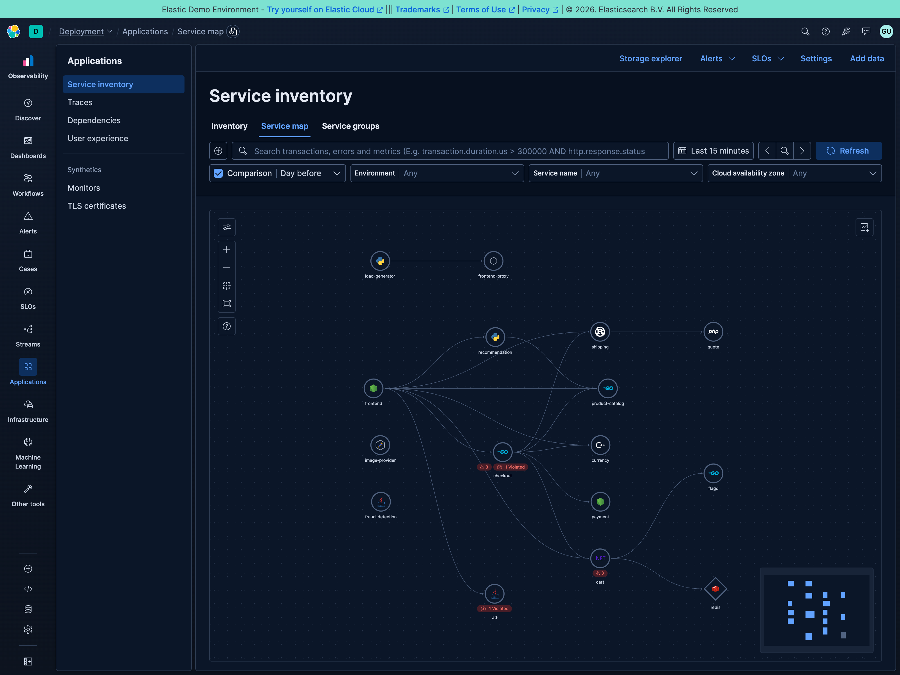
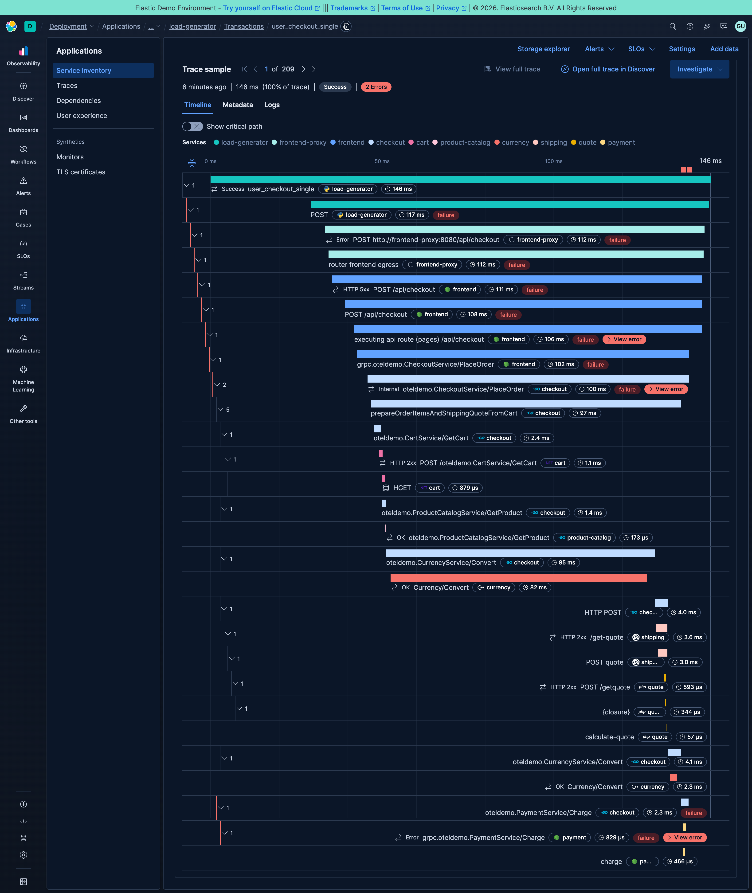
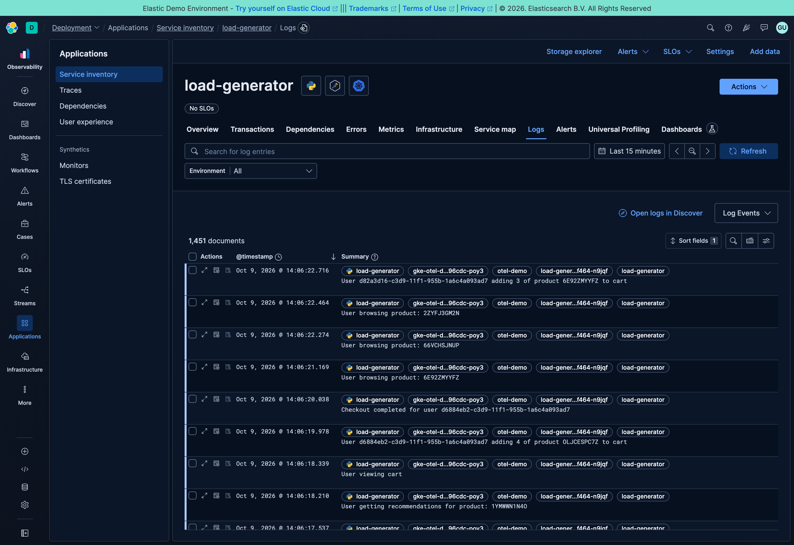

<!-- markdownlint-disable-next-line -->
#  :heavy_plus_sign:  OpenTelemetry Demo with Elastic Observability

Run the **Astronomy Shop**, a microservice demo that generates traffic
automatically, and explore its traces, metrics, and logs in Elastic Observability.

This fork uses **Elastic Distributions of OpenTelemetry (EDOT)** for selected
language agents and the collector. You can also run it with upstream
OpenTelemetry instrumentation while sending telemetry to Elastic.

## Choose your setup

| Goal | Start command | Backend |
| ------ | --------------- | --------- |
| Docker with EDOT | `./demo.sh docker` | Elastic Cloud |
| Everything on your machine | `./demo.sh docker self-hosted` | Local Elastic Stack via start-local |
| Docker with upstream OpenTelemetry | `./demo.sh docker upstream` | Elastic Cloud |
| Kubernetes with EDOT | `./demo.sh k8s` | Elastic Cloud |
| Kubernetes with upstream OpenTelemetry | `./demo.sh k8s upstream` | Elastic Cloud |

For your first run, follow [Docker](#docker). To run without a Cloud account,
choose [local Elastic Stack](#local-elastic-stack-with-start-local).

- [Get the demo](#get-the-demo)
- [Elastic Cloud credentials](#elastic-cloud-credentials)
- [Docker](#docker)
- [Kubernetes](#kubernetes)
- [Verify telemetry and explore](#verify-telemetry-and-explore)
- [Troubleshooting](#troubleshooting)
- [Clean up](#clean-up)
- [Advanced configuration](#advanced-configuration)
- [How this fork differs](#how-this-fork-differs)

## Get the demo

Install [Git](https://git-scm.com/downloads), then clone the Elastic fork:

```sh
git clone https://github.com/elastic/opentelemetry-demo.git
cd opentelemetry-demo
```

Run the commands below from this repository's root directory.

## Elastic Cloud credentials

Complete this section for any Elastic Cloud setup. Skip it for start-local.

1. Use an existing Elastic Cloud Observability deployment or create one at
   [Elastic Cloud](https://cloud.elastic.co/). Choose an Observability project
   for Serverless, or an Observability deployment for Hosted.
2. In Elastic Observability, open **Add data** and select the OpenTelemetry
   application onboarding instructions. See the
   [Elastic OpenTelemetry quickstarts][edot-quickstarts] for your deployment
   type.
3. Copy the `OTEL_EXPORTER_OTLP_ENDPOINT` value and create an API key using the
   onboarding instructions. Keep both available for the startup prompts.

Use the OTLP ingestion endpoint provided by onboarding. The collector is
configured to export OTLP over HTTP; an Elasticsearch REST URL or Kibana URL
is not a substitute for that endpoint.

The startup script prompts for the endpoint and API key unless saved values
already exist in `.env.override`. The API key is hidden while you type it.
Docker EDOT and Kubernetes EDOT setup save these values in `.env.override`:

```dotenv
ELASTIC_OTLP_ENDPOINT="<your-OTLP-endpoint>"
ELASTIC_OTLP_API_KEY="<your-API-key>"
```

To change credentials, edit these values before running the script again.
Keep API keys out of commits. Kubernetes setup also creates a Secret in the
cluster.

## Docker

### Docker prerequisites

- Install [Docker](https://docs.docker.com/get-started/get-docker/) and
  [Docker Compose v2](https://docs.docker.com/compose/install/).
- Start Docker and confirm `docker info` and `docker compose version` work.
- Review the upstream [Docker deployment requirements][docker-docs] for resource
  requirements. Running a local Elastic Stack requires additional resources;
  see [start-local][start-local].
- Keep port `8080` available for the shop. start-local also uses ports
  `9200` and `5601`.

### Docker with EDOT

1. Prepare your [Elastic Cloud credentials](#elastic-cloud-credentials).
2. Start the demo and enter the endpoint and API key when prompted:

   ```sh
   ./demo.sh docker
   ```

   The first run builds images and can take several minutes.
3. Open the shop at <http://localhost:8080> and your Cloud deployment's
   Observability UI. Continue with
   [Verify telemetry and explore](#verify-telemetry-and-explore).

To remove the demo later, use `./demo.sh destroy docker`. See
[Clean up](#clean-up) for what this deletes.

### Local Elastic Stack with start-local

[start-local][start-local] runs Elasticsearch, Kibana, and an EDOT Collector on
your machine for local testing.

1. Start the Elastic Stack with EDOT from the repository root:

   ```sh
   curl -fsSL https://elastic.co/start-local | sh -s -- --edot
   ```

   Keep the Kibana login credentials printed by the installer. The generated
   files are placed in `elastic-start-local/`.
2. Start the demo:

   ```sh
   ./demo.sh docker self-hosted
   ```

   This mode forwards telemetry through the start-local EDOT Collector and does
   not prompt for Cloud credentials.
3. Open the shop at <http://localhost:8080> and Kibana at
   <http://localhost:5601>. Continue with
   [Verify telemetry and explore](#verify-telemetry-and-explore).

The telemetry path is:
`demo services → demo EDOT Collector → start-local EDOT Collector →
Elasticsearch`.
See [Clean up](#clean-up) to stop or remove both stacks.

### Docker with upstream OpenTelemetry

Prepare your [Elastic Cloud credentials](#elastic-cloud-credentials), then run:

```sh
./demo.sh docker upstream
```

This mode uses upstream language instrumentation and the OpenTelemetry Collector
Contrib distribution. It ignores `.env.override` for Compose configuration,
although the script can reuse credentials from that file. Telemetry is exported
to Elastic over OTLP HTTP.

Open <http://localhost:8080>, then
[verify telemetry](#verify-telemetry-and-explore). Some Elastic dashboards may
show less data than in EDOT mode. Remove the demo with
`./demo.sh destroy docker` when finished.

## Kubernetes

### Kubernetes prerequisites

- A running Kubernetes cluster with enough resources for the demo; review the
  [upstream Kubernetes deployment requirements][kubernetes-docs].
- [kubectl](https://kubernetes.io/docs/reference/kubectl/) configured to access
  the cluster, and [Helm](https://helm.sh/) installed.
- [Elastic Cloud credentials](#elastic-cloud-credentials).

Check the cluster you will deploy to:

```sh
kubectl config current-context
kubectl get nodes
helm version
```

The demo is installed in your current Kubernetes namespace. The EDOT collector
stack is installed in `opentelemetry-operator-system`.

### Kubernetes with EDOT

```sh
./demo.sh k8s
```

Enter the endpoint and API key when prompted. The script installs the EDOT
collector stack and the demo using the chart versions pinned in
[demo.sh](../demo.sh).

### Kubernetes with upstream OpenTelemetry

```sh
./demo.sh k8s upstream
```

This installs the demo with upstream instrumentation and its bundled collector,
configured to export telemetry to Elastic. The credential Secret is created in
your current namespace. Some Elastic dashboards may show less data than in
EDOT mode.

### Open the shop

Check the demo pods and find the frontend proxy Service:

```sh
kubectl get pods -l app.kubernetes.io/instance=my-otel-demo
kubectl get services -l app.kubernetes.io/instance=my-otel-demo
```

Copy the Service name containing `frontend-proxy` and substitute it below:

```sh
kubectl port-forward service/<frontend-proxy-service-name> 8080:8080
```

Keep the command running while you visit <http://localhost:8080>. If you
installed in another namespace, add `-n <namespace>` to the commands.
Continue with [Verify telemetry and explore](#verify-telemetry-and-explore).
See [Clean up](#clean-up) for removal instructions.

### Kubernetes architecture


## Verify telemetry and explore

The load generator automatically browses products, adds items to carts, and
checks out. You can also browse the shop and complete a checkout with fake
payment details to generate your own requests.

1. Open your Elastic Observability UI (Cloud), or <http://localhost:5601>
   (start-local).
2. Select a recent time range, such as the last 15 minutes, and open the APM
   **Services** view. Allow a few minutes for initial telemetry to appear and
   refresh the view.
3. Find `frontend` or `checkout`, open its transactions, and inspect a trace
   sample. A checkout trace should include calls to other shop services such as
   cart, payment, or shipping.
4. Open the service map to explore dependencies. If services or traces are
   missing, follow [Troubleshooting](#troubleshooting).

Use these views to explore further. Navigation names and available dashboards
can vary by Elastic deployment and version.

| View | What to explore |
| ------ | ----------------- |
| APM services | Latency, throughput, errors, and transaction traces |
| Service map | Dependencies between the shop's services |
| Logs / Discover | Service logs and correlation with trace IDs |
| Hosts | CPU, memory, disk, and network metrics collected by EDOT |
| Infrastructure | Available container, pod, and node telemetry |
| Dashboards | `[System] OTel Host Metrics` and, for Kubernetes, `[Kubernetes] Cluster Overview`, when installed |

### Example screenshots

#### Service map



#### Traces



#### Correlation


#### Logs



## Troubleshooting

| Symptom | What to check |
| --------- | --------------- |
| Docker cannot start containers | Run `docker info`; start Docker if needed. Check available memory against the deployment requirements. |
| Port already in use | Free port `8080` for the shop; for start-local, also check `9200` and `5601`. Stop another demo before switching modes. |
| No services or traces in Elastic | Check the UI time range, generate a checkout, and inspect collector logs for export errors. |
| Collector reports HTTP 401 or 403 | Check the API key and its ingestion permissions. Update `.env.override` and rerun the selected startup command. |
| Collector reports connection or endpoint errors | Use the OTLP HTTP endpoint from onboarding and check connectivity from the collector's environment. |
| Self-hosted startup reports a missing network | Run start-local with `--edot` first; the demo expects the `elastic-start-local_default` Docker network. |
| Kubernetes pods stay Pending or restart | Inspect pod events and logs for resource, image-pull, or configuration errors. |

For Docker, inspect container status and collector logs:

```sh
docker ps -a --filter name=otel-collector
docker logs --tail 100 otel-collector
```

For Kubernetes, inspect the demo and collector pods:

```sh
kubectl get pods -l app.kubernetes.io/instance=my-otel-demo
kubectl get pods -n opentelemetry-operator-system
kubectl describe pod <pod-name> -n <namespace>
kubectl logs <collector-pod-name> -n <namespace> --tail=100
```

For upstream mode, find the collector in the demo namespace. For start-local
installation problems, see the [start-local troubleshooting
guidance][start-local].

## Clean up

Run cleanup from the repository root.

### Docker demo

```sh
./demo.sh destroy docker
```

This removes the demo containers and its Compose volumes through `make stop`.
It does not remove the separately installed start-local backend.

### Local Elastic Stack

After removing the demo, stop Elasticsearch, Kibana, and the local collector:

```sh
./elastic-start-local/stop.sh
```

To uninstall the local Elastic Stack and permanently delete its data:

```sh
./elastic-start-local/uninstall.sh
```

### Kubernetes demo

For EDOT mode:

```sh
./demo.sh destroy k8s
```

Run this in the namespace used for installation. It removes the demo release,
the collector stack, its credential Secret, and the
`opentelemetry-operator-system` namespace. Use this cleanup only when that
namespace is dedicated to this demo.

For upstream mode, remove the demo release and its Secret in the demo namespace:

```sh
helm uninstall my-otel-demo
kubectl delete secret elastic-secret-otel
```

These commands do not delete telemetry already stored in Elastic Cloud.

## Advanced configuration

### Manual Docker configuration

Prepare your [Elastic Cloud credentials](#elastic-cloud-credentials), then edit
`.env.override` with your endpoint and API key. Keep the Elastic image,
Dockerfile, and collector overrides provided by this fork.

Start the demo with the same Compose layers used by the automated EDOT setup:

```sh
docker compose --env-file .env --env-file .env.override \
  -f compose.yaml -f compose.full.yaml -f compose.observability.yaml \
  -f compose.extras.yaml -f docker-compose.elastic.yml \
  up --build --force-recreate --remove-orphans --detach
```

### Manual Kubernetes configuration

Follow the [EDOT Kubernetes quickstart][edot-quickstarts] for your Elastic
deployment type. The demo's
[Helm values](../kubernetes/elastic-helm/demo.yml) expect the collector at
`opentelemetry-kube-stack-daemon-collector.opentelemetry-operator-system.svc.cluster.local`.
If your collector uses a different name or namespace, update
`default.envOverrides` in those values before installation.

Use the demo chart version pinned by `DEMO_HELM_VERSION` in
[demo.sh](../demo.sh):

```sh
helm repo add open-telemetry https://open-telemetry.github.io/opentelemetry-helm-charts
helm repo update open-telemetry
helm upgrade --install my-otel-demo open-telemetry/opentelemetry-demo \
  --version <DEMO_HELM_VERSION> -f kubernetes/elastic-helm/demo.yml
```

### Enable Kubernetes browser traffic

Browser traffic generation is disabled in the EDOT demo values. To enable it:

1. Set `LOCUST_BROWSER_TRAFFIC_ENABLED` to `"true"` in
   [demo.yml](../kubernetes/elastic-helm/demo.yml).
2. Configure CORS on the daemon collector's OTLP HTTP receiver to allow the
   simulated browser's origin:

   ```yaml
   receivers:
     otlp:
       protocols:
         http:
           cors:
             allowed_origins:
               - http://frontend-proxy:8080
   ```

3. Apply the collector configuration through your Helm values and upgrade the
   demo release with the updated `demo.yml`.

### Test a custom collector component

Build a collector image following the
[Elastic collector components instructions][collector-components]. Define the
component in the collector configuration and include it in the relevant
`service.pipelines` entry.

For Docker, set `COLLECTOR_CONTRIB_IMAGE` and `OTEL_COLLECTOR_CONFIG` in
`.env.override`, then use [manual Docker setup](#manual-docker-configuration).
The automated Cloud EDOT command resets those two values.

For Kubernetes, customize the collector image and configuration in
[kube-stack-overrides.yml](../kubernetes/elastic-helm/kube-stack-overrides.yml)
using the values supported by the pinned kube-stack chart, then upgrade the
collector release. See [demo.sh](../demo.sh) for the release, chart version,
and values files used by automated setup.

### Optional agentic services

The chatbot, agent, and MCP services demonstrate an AI-assisted shopping
workflow. See the [agent README](../src/agent/README.md) and
[chatbot README](../src/chatbot/README.md) for startup instructions and how to
configure an OpenAI-compatible LLM.

## How this fork differs

The EDOT modes replace selected upstream agents and the collector:

| Language | Services | Implementation |
| ---------- | ---------- | ---------------- |
| Java | Ad, Fraud Detection, Kafka | EDOT Java agent |
| .NET | Cart, Accounting | EDOT .NET with zero-code instrumentation |
| Node.js | Payment | EDOT Node.js agent |
| Python | Recommendation | EDOT Python |
| PHP | Quote | EDOT PHP with zero-code instrumentation |

See the services' `Dockerfile.elastic` files and
[docker-compose.elastic.yml](../docker-compose.elastic.yml) for configuration.
The collector uses the [Elastic OpenTelemetry Collector
distribution][edot-collector].
Upstream modes use upstream instrumentation and the Collector Contrib
distribution instead.

For general application documentation, see the
[upstream demo documentation](https://opentelemetry.io/docs/demo/).
To contribute, read [CONTRIBUTING.md](../CONTRIBUTING.md).

[docker-docs]: https://opentelemetry.io/docs/demo/docker-deployment/
[kubernetes-docs]: https://opentelemetry.io/docs/demo/kubernetes-deployment/
[start-local]: https://github.com/elastic/start-local
[edot-quickstarts]: https://www.elastic.co/docs/solutions/observability/get-started/opentelemetry/quickstart
[edot-collector]: https://www.elastic.co/docs/reference/opentelemetry/edot-collector
[collector-components]: https://github.com/elastic/opentelemetry-collector-components
